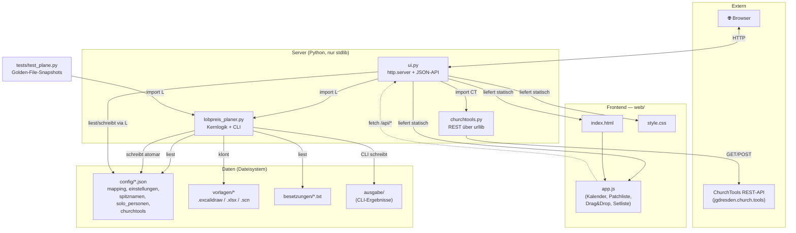
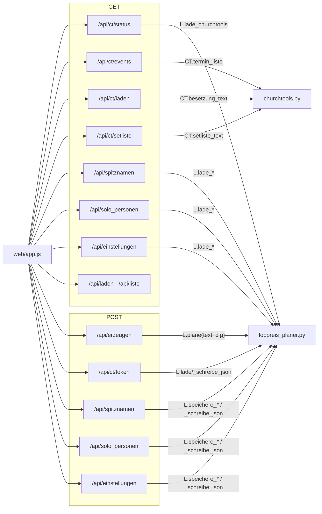
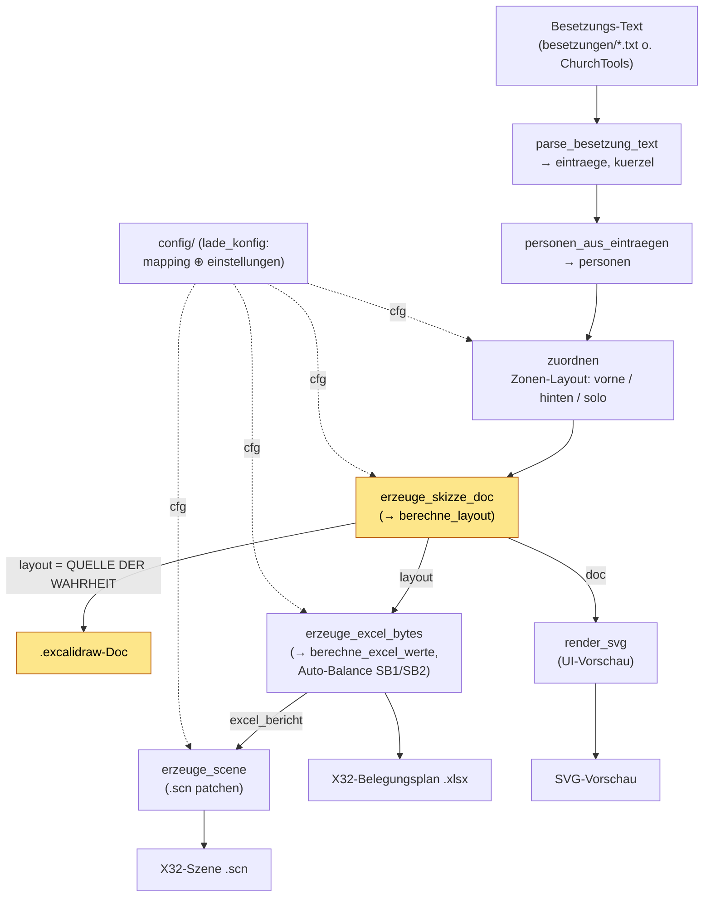

# Architektur-Graph

Automatisch aus dem Code abgeleitete Übersicht (verifiziert gegen `import`-Zeilen,
`ui.py`-Routen, `web/app.js`-`fetch`-Aufrufe und die `plane()`-Pipeline). Die
Diagramme sind [Mermaid](https://mermaid.js.org/) und rendern direkt auf GitHub —
keine zusätzlichen Werkzeuge nötig.

## 1. Module & Abhängigkeiten

Wer importiert/ruft wen, und welche Dateien gelesen/geschrieben werden.

## 2. HTTP-API (Frontend ↔ ui.py)

Alle von `web/app.js` aufgerufenen Endpunkte und ihre serverseitige Anbindung.

## 3. Datenfluss in `plane()`

Die zentrale Pipeline (CLI **und** UI rufen dieselbe Funktion). Die
Bühnenskizze (`layout`) ist die **einzige Quelle der Wahrheit**; Excel und
Szene werden daraus abgeleitet.

